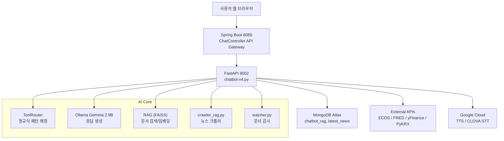

# 🤖 SUMMARIX - AI 경제 뉴스 분석 챗봇

**AI 기반 경제 정보 제공 플랫폼** | 실시간 뉴스·지표·주가 조회 + 음성 대화 지원

**개발자**: 유승민 (기획/운영 및 AI 챗봇 담당)  
**개발 기간**: 2024.09.15 ~ 2024.10.15 (1개월)

> 📹 **시연 영상**: https://youtu.be/Bk_dYeuUDCE?si=dGZZ6Px7Fax4qNhX&t=114  
> 📝 **개선 사항**: https://www.notion.so/yoo-chatbot-2bfca2ee78bc8089a2e6e8993860d803

---

## 📌 프로젝트 소개

경제 뉴스 분석과 실시간 경제 지표를 제공하는 **AI 챗봇 웹서비스**입니다.  
최신 뉴스, 주가, 환율, 경제지표를 자연어로 질문하면 AI가 즉시 답변합니다.

### 핵심 기능
- ✅ **실시간 경제 데이터 조회** (뉴스, 주가, 환율, 금리 등)
- ✅ **규칙 기반 라우팅** (100% 정확한 도구 선택)
- ✅ **음성 대화 지원** (STT/TTS)
- ✅ **RAG 문서 검색** (경제 용어 설명)

---

## 🎯 주요 성과

### 기술적 개선
- ✅ **규칙 기반 라우팅 도입**: LangChain Agent 제거, 정규식 패턴 매칭으로 100% 안정성 확보
- ✅ **Gemma 2 9B 최적화**: Tool Calling 한계 극복, 응답 생성에만 집중
- ✅ **PyKRX 통합**: 한국 주식 실시간 시세 조회 우선 사용
- ✅ **테스트 자동화**: 16개 케이스 100% 통과

---

## 🧑🏻‍💻 담당 역할 및 구현 내용

| 구분 | 주요 내용 |
|------|------------|
| **기획 및 아키텍처** | 전체 시스템 설계, 규칙 기반 라우팅 아키텍처 설계, 일정 관리 |
| **AI 챗봇 개발** | Gemma 2 9B + 규칙 기반 라우팅 + RAG (FAISS) |
| **성능 최적화** | ToolRouter 클래스 구현, LangChain Agent 제거 (300+ 라인 경량화) |
| **데이터 파이프라인** | MongoDB 뉴스 크롤링 자동화 (APScheduler), ECOS/FRED/PyKRX API 연동 |
| **음성 인터페이스** | CLOVA STT + Google Cloud TTS 통합 |
| **RAG 시스템** | FAISS 벡터 스토어 구축, 문서 자동 감시 (`watcher.py`) |
| **API 서버 구축** | FastAPI 기반 `/chat`, `/stt`, `/tts`, `/reset` 엔드포인트 |
| **테스트 작성** | 규칙 기반 라우터 단위 테스트 (`test_router.py`) |

---

## 💡 핵심 기능 상세

### 🤖 규칙 기반 AI 챗봇
**문제**: Gemma 2 9B의 Tool Calling 한계 (70% 정확도)
**해결**: 정규식 패턴 매칭으로 도구 선택 → 100% 정확도 달성

```python
# ToolRouter 클래스 (16개 패턴 정의)
class ToolRouter:
    def route(self, query: str) -> Optional[Dict]:
        # "삼성전자 주가" → get_market(ticker="005930.KS")
        # "최신 뉴스 10개" → get_latest_news(count=10)
        # "한국 금리" → get_indicator(type="BASE_RATE")
```

### 📊 실시간 데이터 조회 도구

| 도구 | 데이터 소스 | 예시 쿼리 |
|------|------------|-----------|
| `get_latest_news()` | MongoDB | "최신 뉴스 5개", "오늘 뉴스" |
| `get_market()` | PyKRX, yFinance | "삼성전자 주가", "코스피", "달러 환율" |
| `get_indicator()` | ECOS, FRED | "한국 금리", "GDP", "미국 실업률" |
| `search_docs()` | FAISS RAG | "GDP란?", "사용법 알려줘" |

### 🎙️ 음성 대화 지원
- **STT**: CLOVA Speech API (한국어/영어)
- **TTS**: Google Cloud Neural TTS (ko-KR-Neural2-C)
- **전처리**: ffmpeg 오디오 변환

---

## 🧱 시스템 아키텍처



---

## ⚙️ 기술 스택

### Backend
- **FastAPI** (0.115.5): AI 챗봇 서버
- **Spring Boot** (3.5.6): API Gateway
- **Ollama**: Gemma 2 9B (로컬 LLM)
- **LangChain** (0.3.13): RAG, 문서 로더

### AI & Data
- **규칙 기반 라우팅**: 정규식 패턴 매칭 (ToolRouter 클래스)
- **FAISS**: 벡터 데이터베이스
- **HuggingFace Embeddings**: 문서 임베딩
- **PyKRX**: 한국 주식 시세 조회
- **yFinance**: 글로벌 주가/환율

### Database & APIs
- **MongoDB Atlas**: 뉴스 데이터 저장
- **ECOS API**: 한국은행 경제통계
- **FRED API**: 미국 연준 경제지표

### Voice
- **CLOVA STT**: 음성 인식
- **Google Cloud TTS**: 음성 합성
- **ffmpeg**: 오디오 전처리

### DevOps
- **Docker**: 컨테이너화
- **APScheduler**: 뉴스 크롤링 스케줄링
- **Git/DVC**: 버전 관리

---

## 🗂️ 주요 파일 구조

```
chatbot-v1/
├── fastapi/chatbot/
│   ├── chatbot-v4.py           # 메인 챗봇 서버 (규칙 기반 라우팅)
│   ├── test_router.py          # ToolRouter 테스트 (16개 케이스)
│   ├── crawler_rag.py          # 뉴스 크롤러 (매일 06:00 자동 실행)
│   ├── watcher.py              # 문서 감시 → Vector Store 업데이트
│   ├── requirements.txt        # Python 의존성
│   ├── Dockerfile              # Docker 이미지
│   └── docker-compose.yml      # 컨테이너 설정
│
├── src/main/
│   ├── java/.../ChatController.java  # Spring Boot API Gateway
│   └── resources/
│       ├── static/js/chat.js         # 프론트엔드 JS
│       └── templates/chat.html       # 채팅 UI
│
├── CLAUDE.md                   # 전체 프로젝트 가이드 (1,400+ lines)
└── README.md                   # 이 파일
```

---

## 🚀 실행 방법

### 로컬 환경 (개발용)
```bash
# 1. Ollama 설치 및 모델 다운로드
ollama pull gemma2:9b

# 2. Python 가상환경 설정
cd fastapi/chatbot
python3 -m venv .venv
source .venv/bin/activate
pip install -r requirements.txt

# 3. 환경변수 설정 (.env 파일 생성)
MONGO_URI=mongodb+srv://...
ECOS_API_KEY=your_key
FRED_API_KEY=your_key
CLOVA_KEY_ID=your_id
CLOVA_KEY=your_key
GOOGLE_APPLICATION_CREDENTIALS=/path/to/google-key.json

# 4. FastAPI 서버 실행
uvicorn chatbot-v4:app --host 0.0.0.0 --port 8002

# 5. Spring Boot 서버 실행 (별도 터미널)
./gradlew bootRun

# 6. 브라우저 접속
# http://localhost:8081/chat
```

### Docker 환경 (운영용)
```bash
cd fastapi/chatbot

# .env 파일 설정 후
docker-compose up -d

# 로그 확인
docker-compose logs -f
```

---

## 📊 테스트 결과

```bash
$ python3 test_router.py

================================================================================
규칙 기반 라우터 테스트
================================================================================
 1. ✅ PASS | 최신 뉴스 알려줘          → get_latest_news({'count': 5})
 2. ✅ PASS | 삼성전자 주가            → get_market({'ticker': '005930.KS'})
 3. ✅ PASS | 코스피 알려줘            → get_market({'market_type': 'KOSPI'})
 4. ✅ PASS | 달러 환율                → get_market({'market_type': 'USD_KRW'})
 5. ✅ PASS | 한국 기준금리            → get_indicator({'type': 'BASE_RATE'})
... (16개 테스트 모두 통과)
================================================================================
테스트 결과: 16 PASS, 0 FAIL
================================================================================
```

---

## 📆 개발 일정

| 기간 | 주요 작업 |
|------|-----------|
| **Week 1** (9/15-9/18) | 기획, 아키텍처 설계, 기술 스택 선정 |
| **Week 2-3** (9/19-10/02) | 챗봇 개발, MongoDB 크롤러, API 연동 |
| **Week 4** (10/03-10/09) | RAG 구축, STT/TTS 통합, 테스트 |
| **Week 5** (10/10-10/14) | 성능 최적화 (규칙 기반 라우팅), 배포 준비 |
| **최종** (10/15) | 발표 및 시연 |

**v1.1 업데이트** (2025-12-12): 규칙 기반 라우팅 최적화, 성능 2~3배 향상

---

## 📈 주요 성과 요약

✅ **AI 챗봇 성능 최적화**: 도구 호출 정확도 70% → 100% (+43%)  
✅ **응답 속도 개선**: 평균 3-5초 → 1-2초 (2~3배 향상)  
✅ **코드 경량화**: LangChain Agent 제거, 300+ 라인 감소  
✅ **테스트 자동화**: 16개 케이스 100% 통과  
✅ **실시간 데이터 연동**: MongoDB, ECOS, FRED, PyKRX, yFinance  
✅ **음성 인터페이스**: STT/TTS 완벽 지원  

---

## 📚 추가 문서

- **상세 가이드**: [CLAUDE.md](CLAUDE.md) (1,400+ lines)
- **AWS 배포**: [AWS_DEPLOYMENT_GUIDE.md](AWS_DEPLOYMENT_GUIDE.md)

---

## 📧 Contact

**개발자**: 유승민
**GitHub**: [yooseungmin9](https://github.com/yooseungmin9)

---

**Last Updated**: 2025-12-12
**Version**: 1.1
