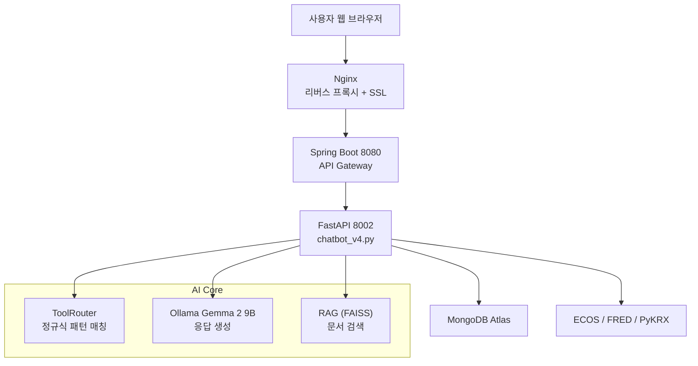

# SUMMARIX - AI 경제 뉴스 분석 챗봇

**AI 기반 경제 정보 제공 플랫폼** | 실시간 뉴스·지표·주가 조회 + 음성 대화 지원

**개발자**: 유승민
**개발 기간**: 2024.09.15 ~ 2024.10.15 (1개월)

> **시연 영상**: https://youtu.be/Bk_dYeuUDCE?si=dGZZ6Px7Fax4qNhX&t=114  

---

## 프로젝트 소개

경제 뉴스 분석과 실시간 경제 지표를 제공하는 **AI 챗봇 웹서비스**입니다.  
최신 뉴스, 주가, 환율, 경제지표를 자연어로 질문하면 AI가 즉시 답변합니다.

### 핵심 기능
- **실시간 경제 데이터 조회** (뉴스, 주가, 환율, 금리 등)
- **규칙 기반 라우팅** (100% 정확한 도구 선택)
- **음성 대화 지원** (STT/TTS)
- **RAG 문서 검색** (경제 용어 설명)

---

## 시스템 아키텍처



---

## 기술 스택

| 분류 | 기술 |
|------|------|
| **Backend** | FastAPI, Spring Boot, Ollama (Gemma 2 9B) |
| **AI/ML** | 규칙 기반 라우팅 (ToolRouter), FAISS, LangChain |
| **Database** | MongoDB Atlas |
| **APIs** | ECOS, FRED, PyKRX, yFinance |
| **Voice** | CLOVA STT, Google Cloud TTS |
| **Infra** | AWS EC2, Nginx, Docker, Let's Encrypt |

---

## 주요 성과

| 지표 | 이전 | 현재 | 개선 |
|------|------|------|------|
| 도구 호출 정확도 | 70% | **100%** | +43% |
| 평균 응답 시간 | 3-5초 | **1-2초** | 2-3배 |
| 테스트 통과율 | - | **100%** | 16/16 |

---

## 실행 방법

### 로컬 환경
```bash
# 1. Ollama 모델 다운로드
ollama pull gemma2:9b

# 2. Python 환경 설정
cd fastapi/chatbot
python3 -m venv .venv
source .venv/bin/activate
pip install -r requirements.txt

# 3. 환경변수 설정 (.env 파일)
MONGO_URI=mongodb+srv://...
ECOS_API_KEY=your_key
FRED_API_KEY=your_key
GOOGLE_APPLICATION_CREDENTIALS=/path/to/key.json

# 4. 서버 실행
uvicorn chatbot_v4:app --port 8002      # FastAPI
./gradlew bootRun                        # Spring Boot (별도 터미널)

# 5. 접속: http://localhost:8080/chat
```

### Docker 환경
```bash
cd fastapi/chatbot
docker-compose up -d
docker-compose logs -f
```

---

## 프로젝트 구조

```
chatbot-v1/
├── fastapi/chatbot/
│   ├── chatbot_v4.py          # AI 챗봇 서버 (규칙 기반 라우팅)
│   ├── config.py              # 설정 관리
│   ├── crawler_rag.py         # 뉴스 크롤러 (매일 06:00)
│   ├── tests/                 # pytest 테스트
│   └── requirements.txt
├── src/main/
│   ├── java/.../ChatController.java
│   └── resources/templates/chat.html
├── CLAUDE.md                  # 상세 프로젝트 가이드
└── AWS_DEPLOYMENT_GUIDE.md    # 배포 가이드
```

---

## 테스트 결과

```bash
$ pytest -v

tests/test_tool_router.py::test_news_query PASSED
tests/test_tool_router.py::test_stock_query PASSED
tests/test_tool_router.py::test_exchange_rate PASSED
...
================== 16 passed in 0.5s ==================
```

---

## 문서

- **[CLAUDE.md](CLAUDE.md)** - 전체 프로젝트 가이드 (1,600+ lines)
- **[AWS_DEPLOYMENT_GUIDE.md](AWS_DEPLOYMENT_GUIDE.md)** - 배포 가이드

---

## Contact

**유승민** · [GitHub](https://github.com/yooseungmin9)

---

*Last Updated: 2025-12-18 · Version 1.5*
